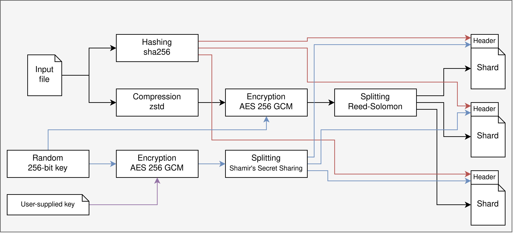

# stitch 🩹

Compress, encrypt, and split files into pieces. Then stitch them together again.

```
# Building
make

# Testing
make test
```

## How it works



## Use the command-line interface

Currently there is a basic CLI for the pipeline encoder:

```
go run ./cmd/stitch pipeline --help
```

To encode files, use the `-input` flag:

```
go run ./cmd/stitch pipeline -input file.bin
```

The command will create `file.bin.shardX` files in the same directory. To
decode, use the `-output` flag:

```
go run ./cmd/stitch pipeline -output file.bin
```

The command will look for `file.bin.shardX` files and use it to reconstruct
`file.bin`.

## Usage as a library

Check the Go FAQ on
[how to use private modules](https://go.dev/doc/faq#git_https). Specifically,

1. Add the following two lines to your `~/.gitconfig` file:

   ```
   [url "ssh://git@github.com/"]
       insteadOf = https://github.com/
   ```

2. Grab the dependency:

   ```bash
   export GOPRIVATE=github.com/OhanaFS/stitch
   go mod download
   ```

3. Import it as a library:

   ```go
   package main

   import (
     "github.com/OhanaFS/stitch"
   )

   func main() {
     enc := stitch.NewEncoder(&stitch.EncoderOptions{
       DataShards: 5,
       ParityShards: 3,
       KeyThreshold: 3,
     })

     err := enc.Encode(

     )
     if err != nil {
       panic(err)
     }
   }
   ```
